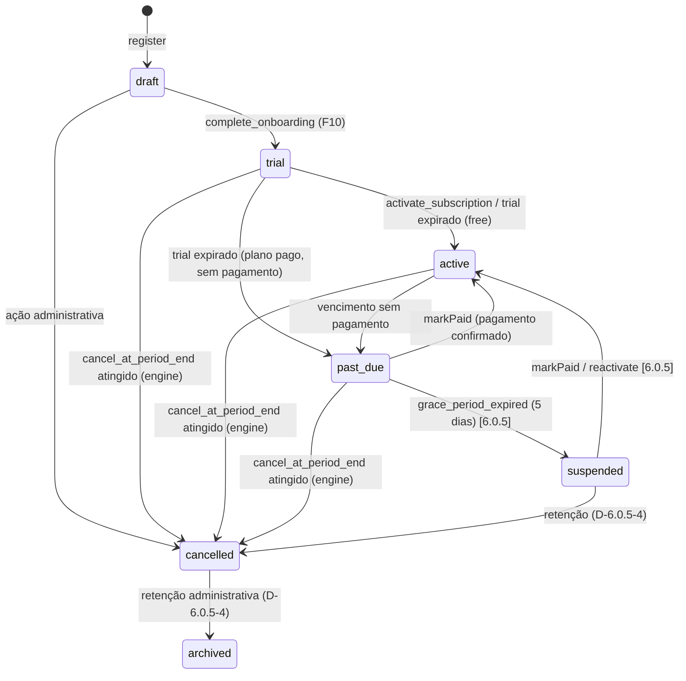

# Tenant Lifecycle Model

> **Fase:** 6.0.0 — SaaS Domain Consolidation
> **Status:** ✅ REVISADO PELO PO — 2026-07-28 · **ALINHADO AO ADR-013 — 2026-08-06** (Subfase 0)
> **Decisões:** Ver `BUSINESS_DECISIONS.md` (F3, F4, F5, F10) e `docs/adr/ADR-013-billing-tenant-featureflags.md`
>
> Este documento é o modelo **conceitual** do ciclo de vida do tenant. O contrato operacional (RPCs, eventos, writer) está em `TENANT_LIFECYCLE.md`; o contrato comercial em `SUBSCRIPTION_MODEL.md`. A máquina congelada é a do **ADR-013 §5** — em caso de divergência, o ADR prevalece.

---

## 1. Máquina de Estados



**Regra do PO:** `draft → trial → active` é obrigatório. **Nunca** `draft → active` direto, mesmo com trial de zero dias — mantém o fluxo consistente (F10).

**Notas (ADR-013):**
- Pedido de cancelamento **não é transição** — apenas grava `cancel_at_period_end` (D-A). Todas as setas para `cancelled` acima são **efetivações** feitas pelo Billing Engine quando o fim do período é atingido.
- Não existe `active → draft` (admin_reset) — removido da máquina congelada.
- Não existe `cancelled → active` na máquina congelada; reativação é `suspended → active` (D-6.0.5-2/4).

---

## 2. Estados

| Estado | Descrição | Acesso | Ações permitidas |
|--------|-----------|--------|------------------|
| `draft` | Tenant criado, onboarding pendente | ❌ Bloqueado | complete_onboarding |
| `trial` | Período de avaliação (14d, âncora `tenants.created_at`) | ✅ Completo | pagamento, cancel |
| `active` | Plano pago ou free | ✅ Completo | todas |
| `past_due` | Período vencido — grace (5 dias) | 🔷 **Read-only com aviso** *(D-6.0.5-1)* | leitura, pagamento, cancel |
| `suspended` | Grace expirado — dados preservados (F5) | ❌ Bloqueado *(D-6.0.5-2)* | pagamento, reactivate |
| `cancelled` | Cancelado — `cancel_at_period_end` atingido | 🔷 **Somente leitura** *(D-6.0.5-2)* | leitura, exportação, relatórios |
| `archived` | Arquivado — dados preservados (F5, nunca excluídos) | ❌ Nenhum | — |

> **Acesso (ADR-013 §2.4):** a coluna "Acesso" é decisão de **Estado Efetivo** (Subscription + Tenant + Feature Flags), avaliada na camada de autorização. Níveis definidos pelas decisões **D-6.0.5-1** (`past_due` = read-only com aviso) e **D-6.0.5-2** (`cancelled` = somente leitura), aprovadas pelo PO em 2026-08-06. **Proibido** decidir acesso com `if (tenant.status === 'active')` ou variantes.

---

## 3. Transições e Regras

### 3.1 `draft → trial`
- **Gatilho:** `complete_onboarding()` RPC chamado com sucesso
- **Validação:** `tenants.status = 'draft'`
- **Side effects:**
  - tenant_settings criado
  - `profiles.onboarding_completed = true`
  - subscription `trialing` criada (trial 14 dias, âncora `tenants.created_at`)
  - Evento: `TenantSubscriptionCreated` + `TenantTrialStarted` (D2)
  - Plano `free`: no fim do trial, a engine efetiva `trialing → active` (não existe `trial_days = 0` no schema)

### 3.2 `active → past_due`
- **Gatilho:** Vencimento (`current_period_end`) sem pagamento confirmado — avaliação pelo Billing Engine (ciclo `runCycle`)
- **Validação:** `current_period_end < now()` e nenhum pagamento registrado
- **Side effects:** grace de 5 dias inicia (janela temporal, **nunca** status), notificação ao usuário
- **Nota:** **sem gateway de pagamento** e **sem dunning** implementados — a cobrança é registrada via RPCs de pagamento. A ausência de gateway é um risco conhecido (ver Entry Audit 6.0.5, H4/B2)

### 3.3 `past_due → suspended`
- **Gatilho:** `grace_period_expired` (**5 dias** após o vencimento) — engine `runCycle` **[6.0.5.4]**
- **Efeito:** Acesso bloqueado, dados preservados (F5), notificação enviada
- **Nota:** o `subscriptions.status` não possui `suspended` hoje — será **aditivo** no CHECK na 6.0.5.4 (D-6.0.5-2)

### 3.4 `suspended → cancelled`
- **Gatilho:** ação administrativa do **superadmin** (manual — D-6.0.5-4 aprovada: sem TTL, sem exclusão automática)
- **Efeito:** Dados **preservados** (F5 — nunca excluídos automaticamente). Qualquer referência a TTL de exclusão é obsoleta

### 3.5 `suspended → active`
- **Gatilho:** `markPaid` (pagamento confirmado) ou `reactivate` **[6.0.5.4]**
- **Efeito:** subscription `active`, acesso restaurado
- **Nota:** reativação **pós-cancelamento** (`cancelled → active`) **não existe** na máquina congelada — cancelado é terminal (ADR-013 §5). Eventual reativação de `cancelled` só via **novo fluxo comercial futuro** (D-6.0.5-2)

### 3.6 `cancelled → archived`
- **Gatilho:** ação administrativa **manual** do superadmin (D-6.0.5-4 — sem TTL)
- **Efeito:** Dados preservados (nunca excluídos automaticamente — F5), tenant removido de listagens ativas

---

## 4. Domain Service

```typescript
interface TenantLifecycleService {
  completeOnboarding(tenantId: UUID, settings: TenantSettingsInput): Promise<void>;
  transitionTo(tenantId: UUID, to: TenantStatus, reason: string): Promise<void>;
  getValidTransitions(status: TenantStatus): TenantStatus[];
  canAccess(status: TenantStatus): boolean;
}
```

### 4.1 Transições Válidas

> Alinhado à matriz congelada do **ADR-013 §5.2**. As transições são efetivadas pelo **Billing Engine** (`apply_subscription_transition` / `runCycle`) e aplicadas ao tenant por **writer único** (TenantLifecycleService — ADR-013 §3.1). Na 6.0.5.4 a responsabilidade é dividida para garantir o Single Writer.

```typescript
const VALID_TRANSITIONS: Record<TenantStatus, TenantStatus[]> = {
  draft:      ['trial', 'cancelled'],
  trial:      ['active', 'past_due', 'cancelled'],
  active:     ['past_due', 'cancelled'],
  past_due:   ['active', 'suspended', 'cancelled'],
  suspended:  ['active', 'cancelled'],   // 6.0.5
  cancelled:  ['archived'],               // terminal na máquina congelada
  archived:   [],
};
```

> **Nota:** `suspended` e as transições de saída de `suspended` só entram em vigor com o CHECK aditivo da **6.0.5.4** (D-6.0.5-2 aprovada). Hoje `tenants.status` já possui os 7 estados no ENUM, mas o `subscriptions.status` ainda não tem `suspended`.

---

## 5. Bloqueio de Acesso

> **Atenção (ADR-013 §2.4):** a decisão de acesso é de **Estado Efetivo**, não exclusivamente de `tenant.status`. A tabela abaixo é o mapeamento legado de referência; a partir da 6.0.5 o gate real acontece na **camada de autorização** combinando os três contextos. Valores de `past_due`/`cancelled` definidos pelas decisões **D-6.0.5-1/2** (aprovadas pelo PO em 2026-08-06).

```typescript
const ACCESS_BY_STATUS: Record<TenantStatus, 'full' | 'restricted' | 'readonly' | 'none'> = {
  draft:      'none',
  trial:      'full',
  active:     'full',
  past_due:   'restricted',   // D-6.0.5-1: read-only com aviso (grace: janela de 5 dias, não status)
  suspended:  'none',         // D-6.0.5-2: bloqueado
  cancelled:  'readonly',     // D-6.0.5-2: somente leitura (exportação/retenção)
  archived:   'none',
};
```

---

## 6. Eventos de Ciclo de Vida

> **Alinhamento (ADR-013 §5.1, D2):** o catálogo oficial de eventos de billing é o **D2** — `TenantSubscriptionCreated`, `TenantTrialStarted`, `TenantSubscriptionUpdated`, `TenantSubscriptionCancelled` (+ `TenantSubscriptionSuspended`/`Reactivated` na **6.0.5**), publicados pelo Billing Engine. Eventos do tipo `TenantStatusChanged`/`TenantSuspended`/`TenantArchived` não existem no catálogo atual de `domain/events/types.ts` — transições de status de tenant **não são eventos de domínio hoje** (exigiriam ADR para serem criados).

| Evento | Descrição | Consumer |
|--------|-----------|----------|
| `TenantSubscriptionCreated` | Assinatura criada (draft → trial) | AuditSubscriber |
| `TenantTrialStarted` | Trial iniciado | AuditSubscriber |
| `TenantSubscriptionUpdated` | Mudança de plano/status | AuditSubscriber |
| `TenantSubscriptionCancelled` | `cancel_at_period_end` atingido (efetivação) | FinanceSubscriber, NotificationSubscriber |
| `TenantSubscriptionSuspended` **[6.0.5]** | Grace expirado | NotificationSubscriber |
| `TenantSubscriptionReactivated` **[6.0.5]** | Reativação | BillingService |

---

## 7. Migração Pendente

> Situação atualizada em 2026-08-06 (alinhamento ADR-013). O checklist original (6.0.0) foi resolvido em grande parte pelas fases 6.0.1–6.0.4 e pela entrada na 6.0.5:

- [x] RPC `complete_onboarding()` → `draft → trial` (cria subscription `trialing`)
- [x] RPCs de billing: `start_trial()`, `activate_subscription()`, `cancel_subscription()` (pedido — D-A), `get_subscription()`
- [x] Bloqueio de acesso por status no frontend (`App.tsx` → `ProtectedRoute`)
- [ ] Validação de transições via CHECK/trigger — **não será via DB trigger**: a máquina de estados é o **Billing Engine** (`apply_subscription_transition`/`runCycle`), conforme ADR-013
- [ ] `suspended` aditivo no CHECK de `subscriptions.status` + transições automáticas `past_due → suspended` e `suspended → active` (**6.0.5.4**; D-6.0.5-1/2 aprovadas)
- [ ] Acesso `past_due`/`cancelled` finalizado via camada de autorização (Estado Efetivo — **6.0.5.1/6.0.5.3**; níveis definidos por D-6.0.5-1/2)
