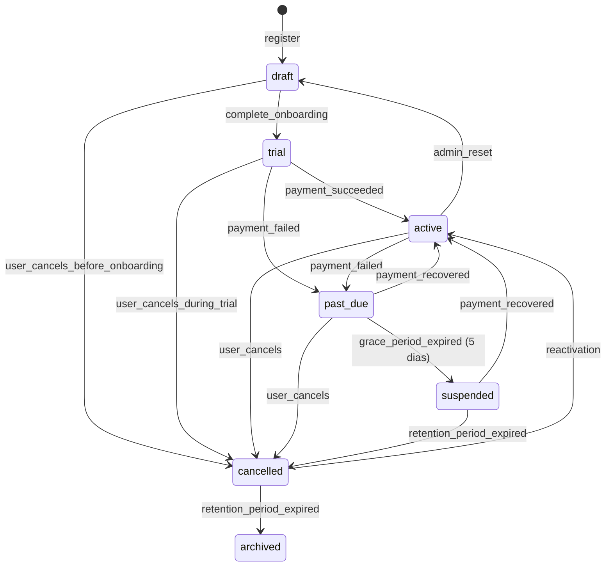

# Tenant Lifecycle Model

> **Fase:** 6.0.0 — SaaS Domain Consolidation
> **Status:** ✅ REVISADO PELO PO — 2026-07-28
> **Decisões:** Ver `BUSINESS_DECISIONS.md` (F3, F4, F5, F10)

---

## 1. Máquina de Estados



**Regra do PO:** `draft → trial → active` é obrigatório. **Nunca** `draft → active` direto, mesmo com trial de zero dias — mantém o fluxo consistente (F10).

---

## 2. Estados

| Estado | Descrição | Acesso | Ações permitidas |
|--------|-----------|--------|------------------|
| `draft` | Tenant criado, onboarding pendente | ❌ Bloqueado | complete_onboarding |
| `trial` | Período de avaliação | ✅ Completo | upgrade, cancel |
| `active` | Plano pago ou free | ✅ Completo | todas |
| `past_due` | Pagamento atrasado | ✅ Completo | pagamento, cancel |
| `suspended` | Atraso prolongado | ❌ Bloqueado | pagamento |
| `cancelled` | Cancelado (retention window) | 🔷 Somente leitura | reativar (30d) |
| `archived` | Definitivamente removido | ❌ Nenhum | — |

---

## 3. Transições e Regras

### 3.1 `draft → trial`
- **Gatilho:** `complete_onboarding()` RPC chamado com sucesso
- **Validação:** `tenants.status = 'draft'`
- **Side effects:**
  - tenant_settings criado
  - `profiles.onboarding_completed = true`
  - Evento: `OnboardingCompleted`
  - subscription `trialing` (sempre — mesmo trial zero dias)
  - Se `plan.trial_days = 0` (free): subscription é `trialing` com `trial_end = now()`, transição imediata para `active`

### 3.2 `active → past_due`
- **Gatilho:** Falha no pagamento (webhook do gateway)
- **Validação:** Tentativas de cobrança exauridas (3 tentativas, 3 dias intervalo)
- **Side effects:** Dunning iniciado, notificação ao usuário

### 3.3 `past_due → suspended`
- **Gatilho:** `grace_period_expired` (**5 dias** após past_due)
- **Efeito:** Acesso bloqueado, dados preservados, notificação enviada

### 3.4 `suspended → cancelled`
- **Gatilho:** `retention_period_expired` (30 dias após suspended)
- **Efeito:** Dados marcados para remoção (TTL de 90 dias)

### 3.5 `cancelled → active`
- **Gatilho:** Reativação via pagamento
- **Janela:** Até 30 dias após cancelled
- **Efeito:** subscription reativada, tenant → active

### 3.6 `cancelled → archived`
- **Gatilho:** `retention_period_expired` (meses após cancelled)
- **Efeito:** Dados preservados (nunca excluídos automaticamente), tenant removido de listagens ativas

---

## 4. Domain Service

```typescript
interface TenantLifecycleService {
  completeOnboarding(tenantId: UUID, settings: TenantSettingsInput): Promise<void>;
  transitionTo(tenantId: UUID, to: TenantStatus, reason: string): Promise<void>;
  getValidTransitions(status: TenantStatus): TenantStatus[];
  canAccess(status: TenantStatus): boolean;
}
```

### 4.1 Transições Válidas

```typescript
const VALID_TRANSITIONS: Record<TenantStatus, TenantStatus[]> = {
  draft:      ['trial', 'cancelled'],
  trial:      ['active', 'past_due', 'cancelled'],
  active:     ['past_due', 'cancelled', 'draft'],
  past_due:   ['active', 'suspended', 'cancelled'],
  suspended:  ['active', 'cancelled'],
  cancelled:  ['active', 'archived'],
  archived:   [],
};
```

---

## 5. Bloqueio de Acesso

```typescript
const ACCESS_BY_STATUS: Record<TenantStatus, 'full' | 'readonly' | 'none'> = {
  draft:      'none',
  trial:      'full',
  active:     'full',
  past_due:   'full',    // Permite acesso durante grace period
  suspended:  'none',
  cancelled:  'readonly',
  archived:   'none',
};
```

---

## 6. Eventos de Ciclo de Vida

| Evento | Descrição | Consumer |
|--------|-----------|----------|
| `TenantStatusChanged` | Transição de status | LifecycleService, BillingService |
| `TenantSuspended` | Acesso bloqueado | NotificationSubscriber |
| `TenantCancelled` | Cancelamento solicitado | FinanceSubscriber |
| `TenantArchived` | Tenant arquivado (dados preservados) | AuditSubscriber |
| `TenantReactivated` | Reativação pós-cancelamento | BillingService |

---

## 7. Migração Pendente

A migration atual (`20260728000000`) criou o ENUM e a coluna `status` mas não implementou:

- [ ] Validação de transições via CHECK constraint ou trigger
- [ ] Transição automática `past_due → suspended` (scheduled job)
- [ ] Transição automática `cancelled → archived` (scheduled job)
- [ ] RPC `transition_tenant_status()`
- [ ] Bloqueio de acesso por status em middleware/guards
