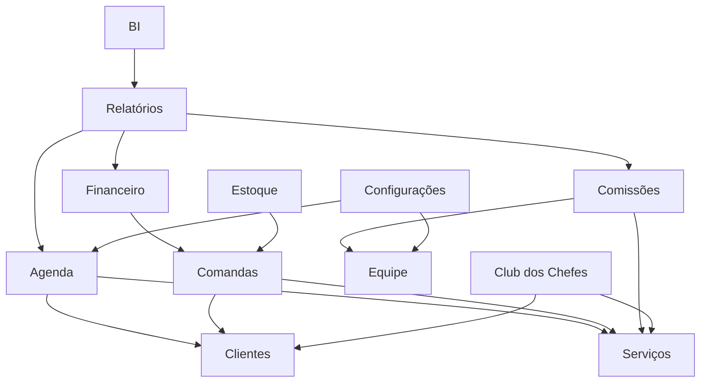

# SMG Platform — SaaS Core Architecture

> **Fase 5.5 — SaaS Core Architecture**
>
> Status: ✅ Concluída (Documentação + Design) · **ALINHADO AO ADR-013 — 2026-08-06** (Subfase 0)
>
> **Autor:** Augusto (Product Owner) + OpenCode (formatação e validação técnica)
>
> **Última atualização:** 2026-08-06
>
> **Aviso (Subfase 0):** este documento é a visão **conceitual/comercial** da plataforma (Fase 5.5). Divergências estruturais foram alinhadas ao **ADR-013** (referência única da arquitetura 6.0.5). Detalhes operacionais (RPCs, schema, eventos) vivem em `TENANT_LIFECYCLE.md`, `SUBSCRIPTION_MODEL.md` e `FEATURE_FLAGS_MODEL.md`. Em caso de divergência, o ADR prevalece.

---

## Visão Geral

Este documento define **como a plataforma SaaS funciona** — os mecanismos que permitem novos clientes entrarem, serem gerenciados, evoluírem de plano, receberem suporte e escalarem a operação.

**Diferença entre Fase 5 e Fase 5.5:**

| Fase | Pergunta | Escopo |
|------|----------|--------|
| **Fase 5** | *O que é a plataforma?* | Produtos, módulos, taxonomia, papéis |
| **Fase 5.5** | *Como a plataforma funciona?* | Nascimento, lifecycle, billing, features, provisionamento |

**Regra:** Toda decisão aqui influencia diretamente a implementação técnica. Nenhuma decisão é "apenas documentação" — cada bloco define estrutura de banco, APIs, UI e comportamento do sistema.

---

## Bloco 1 — Customer Onboarding (Como Nasce um Cliente)

### Pergunta Central

> Quando alguém compra o SMG Barber... o que acontece?

### Fluxo Completo (Decisão do PO — 2026-07-28)

```
1. Visitante acessa barber.soumanager.com
   ↓
2. Clica em "Começar Grátis" ou "Assinar"
   ↓
3. Usuário realiza seu cadastro (nome, email, senha)
   ↓
4. E-mail é validado
   ↓
5. Tenant é criado
   ↓
6. Primeira unidade da empresa é criada automaticamente
   ↓
7. Usuário torna-se Owner do Tenant
   ↓
8. Configurações iniciais da barbearia são gravadas
   ↓
9. Sistema direciona para o primeiro acesso
   ↓
10. Usuário conclui a configuração inicial da operação
```

**Regra:** Nenhum dado operacional (clientes, funcionários, serviços, agenda, comandas etc.) é criado automaticamente. Apenas a estrutura mínima necessária para funcionamento da plataforma.

### ⚠️ Pendências do PO

| # | Item | Status |
|---|------|--------|
| 1 | Dados obrigatórios de cadastro | ✅ Definido (fluxo 8 etapas) |
| 2 | Dados iniciais criados automaticamente | ✅ Definido (nenhum dado operacional) |
| 3 | Horários padrão | ⬜ Pendente |
| 4 | Fluxo de convite para profissionais | ⬜ Pendente |

---

## Bloco 2 — Tenant Lifecycle (Como Funciona um Tenant)

### Estados (Decisão do PO — 2026-07-28; máquina congelada — ADR-013 §5)

> **Alinhamento 6.0.5:** cancelamento é **pedido** (grava `cancel_at_period_end`) — **não é transição**. Reativação acontece em `suspended → active`, **nunca** `cancelled → active` (cancelado é terminal na máquina congelada). `suspended` e a retenção dependem das decisões D-6.0.5-1/2/4.

```
                     ┌──────────────┐
                     │    draft     │ ← Tenant criado durante o onboarding
                     └──────┬───────┘
                            │ Onboarding completo (F10)
                            ▼
                     ┌──────────────┐
                     │    trial     │ ← Período de avaliação (14d)
                     └──────┬───────┘
                            │ Assinatura ativada (engine)
                            ▼
                     ┌──────────────┐
                     │    active    │ ← Assinatura ativa e funcionamento normal
                     └──────┬───────┘
                            │ Vencimento sem pagamento (engine)
                            ▼
                     ┌──────────────┐
                     │  past_due    │ ← Pagamento pendente — grace (5 dias, janela)
                     └──────┬───────┘
                            │ Grace expirado [6.0.5]
                            ▼
                     ┌──────────────┐
                     │  suspended   │ ← Acesso bloqueado [6.0.5]
                     └──────┬───────┘
                            │ Pagamento confirmado → active
                            │ Retenção (D-6.0.5-4)
                            ▼
                     ┌──────────────┐
                     │  cancelled   │ ← cancel_at_period_end atingido (efetivação)
                     └──────┬───────┘
                            │ Retenção administrativa (D-6.0.5-4)
                            ▼
                     ┌──────────────┐
                     │  archived    │ ← Tenant arquivado (dados preservados, F5)
                     └──────────────┘
```

### Transições de Estado

> **Alinhamento 6.0.5:** as transições de contrato são efetivadas pelo **Billing Engine** (`apply_subscription_transition`/`runCycle`) e aplicadas ao tenant por **writer único** (TenantLifecycleService — ADR-013 §3.1). "Cancelamento solicitado" não é transição.

| De | Para | Evento | Ação |
|----|------|--------|------|
| draft | trial | Onboarding completo | Iniciar período de avaliação |
| trial | active | Assinatura ativada / trial expirado (free) | Habilitar acesso total |
| active | past_due | Vencimento sem pagamento | Notificar, iniciar grace (janela de 5 dias) |
| past_due | active | Pagamento confirmado | Reabilitar acesso |
| past_due | suspended | Grace expirado **[6.0.5.4]** | Bloquear acesso, manter dados (F5) |
| suspended | active | Pagamento confirmado (reativação) **[6.0.5.4]** | Reabilitar acesso |
| suspended | cancelled | Retenção encerrada *(D-6.0.5-4)* | Encerrar contrato |
| active | cancelled | `cancel_at_period_end` atingido (efetivação) | Encerrar contrato no fim do período |
| cancelled | archived | Retenção administrativa *(D-6.0.5-4)* | Arquivar dados |

### Impacto por Estado

| Estado | Login | Agendamentos | Financeiro | Club dos Chefes | Relatórios |
|--------|:-----:|:------------:|:----------:|:---------------:|:----------:|
| draft | ✅ | ❌ | ❌ | ❌ | ❌ |
| trial | ✅ | ✅ | ✅ | ✅ | ✅ |
| active | ✅ | ✅ | ✅ | ✅ | ✅ |
| past_due | ⚠️ *(D-6.0.5-1)* | ⚠️ Read-only | ❌ | ⚠️ Read-only | ⚠️ Read-only |
| suspended | ❌ *(D-6.0.5-2)* | ❌ | ❌ | ❌ | ❌ |
| cancelled | ❌ *(D-6.0.5-2)* | ❌ | ❌ | ❌ | ❌ |
| archived | ❌ | ❌ | ❌ | ❌ | ❌ |

> **Alinhamento 6.0.5:** a coluna "Login" é decisão de **Estado Efetivo** (ADR-013 §2.4), avaliada na camada de autorização. Os valores de `past_due`/`suspended`/`cancelled` dependem das decisões D-6.0.5-1/2 do PO. **Proibido** decidir acesso com `if (tenant.status === 'active')` ou variantes.

### Notificações por Transição

| Transição | Canal | Timing |
|-----------|-------|--------|
| draft → trial | Email + In-app | Imediato |
| trial → active | Email + In-app | Imediato |
| active → past_due | Email | Dia do vencimento |
| past_due → suspended | Email + In-app | Ao expirar grace period |
| suspended → active | Email + In-app | Imediato |
| active/suspended → cancelled | Email | Imediato |
| cancelled → archived | Email | Após período de retenção |

### ⚠️ Pendências do PO

| # | Item | Status |
|---|------|--------|
| 1 | Estados do lifecycle | ✅ Definido (draft, trial, active, past_due, suspended, cancelled, archived) |
| 2 | Grace period | ✅ Definido (**janela temporal** de 5 dias após vencimento — **nunca** status; suspensão na 6.0.5.4) |
| 3 | Retenção de dados | ✅ Definido (dados **preservados** — F5; **nunca** excluídos automaticamente; exclusão só por demanda LGPD) |
| 4 | Auditoria de transições | ✅ Definido (eventos críticos registrados via infraestrutura de eventos — catálogo D2) |

---

## Bloco 3 — Billing Architecture (Como Funciona o Billing)

### Decisão do PO (2026-07-28)

A plataforma utilizará **cobrança recorrente mensal**. A arquitetura permanece **desacoplada do gateway de pagamento**. O gateway definitivo será escolhido futuramente. A estrutura deve suportar expansão para diferentes meios de pagamento sem alteração arquitetural.

> **Alinhamento 6.0.5:** **não há gateway de pagamento implementado** — a cobrança é registrada via RPCs de pagamento e o **Billing Engine** (`runCycle`) avalia vencimentos (`current_period_end`), grace (5 dias) e transições. O desacoplamento hoje é do **engine** (ciclo temporal), não de adapters de gateway (H4/B2 — Entry Audit 6.0.5).

**Exemplos futuros (não definidos):** Cartão, PIX, Boleto, outros gateways.

### Modelo de Cobrança

| Tipo | Recorrência | Status |
|------|:----------:|--------|
| Assinatura recorrente | Mensal | ✅ Definido |
| Assinatura anual | Anual | ⬜ Futuro |
| Boleto mensal | Mensal | ⬜ Futuro |
| PIX recorrente | Mensal | ⬜ Futuro |

### Ciclo de Faturamento

> **Alinhamento 6.0.5:** o fluxo abaixo é o **conceitual** (gateway futuro). Na implementação atual, o ciclo é dirigido pelo **Billing Engine** por tempo (`current_period_end` vencido), sem gateway nem dunning. Invoices são emitidas **somente** para planos pagos (`pro`/`premium`) em renovação (D-C).

```
Dia do vencimento → Gerar cobrança → Registrar pagamento → Atualizar período
                                                    ↓
                                       Pagamento não confirmado (vencimento)
                                                    ↓
                                        Grace period (5 dias, janela)
                                          /                \
                                  Pago OK              Expirou
                                      │                    │
                                      ▼                    ▼
                                 Ativar           Suspender [6.0.5]
```

> **Nota (alinhamento):** "Enviar ao gateway → Aguardar pagamento" do diagrama original é **futuro** (gateway não implementado). A suspensão por grace expirado é a **6.0.5.4**.

### Notificações de Pagamento

| Evento | Canal | Mensagem |
|--------|-------|----------|
| Cobrança gerada | Email + In-app | "Sua assinatura foi renovada" |
| Lembrete (3 dias antes) | Email | "Sua assinatura vence em 3 dias" |
| Pagamento confirmado | Email + In-app | "Pagamento confirmado!" |
| Pagamento falhou | Email + In-app | "Houve um problema com seu pagamento" |
| Grace period (dia 3) | Email + In-app | "Seu pagamento está atrasado há 3 dias" |
| Suspensão | Email + In-app | "Sua assinatura foi suspensa" |

### ⚠️ Pendências do PO

| # | Item | Status |
|---|------|--------|
| 1 | Modelo de cobrança | ✅ Definido (recorrência mensal) |
| 2 | Gateway de pagamento | ✅ Definido (desacoplado — **futuro**; hoje engine + RPCs de pagamento, sem gateway) |
| 3 | Meios de pagamento aceitos | ✅ Definido (expansão futura via adapters) |
| 4 | NFe | ⬜ Pendente |
| 5 | Política de reembolso | ⬜ Pendente |

---

## Bloco 3.5 — Notifications (Camada de Notificações)

### Decisão do PO (2026-07-28)

A plataforma deverá possuir uma **camada própria de notificações**. Os canais serão definidos futuramente. A arquitetura não deve depender de um único provedor.

### Princípios

| Princípio | Descrição |
|-----------|-----------|
| **Canais configuráveis** | E-mail, push, WhatsApp, SMS ou outros — definidos futuramente |
| **Provedor desacoplado** | A arquitetura não depende de um único provedor |
| **Extensível** | Novos canais podem ser adicionados sem alteração estrutural |

### Eventos que Disparam Notificações

| Evento | Canal | Status |
|--------|-------|--------|
| Onboarding completo | Configurável | ⬜ Futuro |
| Pagamento confirmado | Configurável | ⬜ Futuro |
| Pagamento falhou | Configurável | ⬜ Futuro |
| Grace period (lembrete) | Configurável | ⬜ Futuro |
| Suspensão | Configurável | ⬜ Futuro |
| Cancelamento | Configurável | ⬜ Futuro |
| Reativação | Configurável | ⬜ Futuro |

---

## Bloco 3.6 — Audit & History (Auditoria e Histórico)

### Decisão do PO (2026-07-28)

Toda alteração crítica do tenant deverá permanecer auditável. Eventos como criação, alteração de plano, suspensão, cancelamento, reativação e exclusão lógica devem permanecer registrados utilizando a infraestrutura de eventos já existente.

**Não implementar nada nesta etapa; apenas documentar.**

### Eventos Críticos a Serem Auditados

| Evento | Aggregate | Status |
|--------|-----------|--------|
| Criação do tenant | tenant | ✅ Documentado |
| Alteração de plano | tenant | ✅ Documentado |
| Suspensão | tenant | ✅ Documentado |
| Cancelamento | tenant | ✅ Documentado |
| Reativação | tenant | ✅ Documentado |
| Exclusão lógica | tenant | ✅ Documentado |

### Infraestrutura

- Utilizar `event_store` existente (Fase 4.3)
- Utilizar `appEventBus` para publicação
- Utilizar `AuditSubscriber` para persistência

---

## Bloco 4 — Feature Flags (Como o Código Sabe o Que Abrir)

### Conceito

Feature flags são a ponte entre **planos comerciais** e **comportamento do código** (3º contexto do ADR-013 — funcionalidade).

```
Plano Free    → Flag: chef_club = false → Botão "Club" não aparece
Plano Pro     → Flag: chef_club = true  → Botão "Club" aparece
```

> **Alinhamento 6.0.5 (Subfase 0):** o catálogo completo de flags, a matriz por plano e o enforcement vivem em **`docs/FEATURE_FLAGS_MODEL.md`** (fonte oficial). Abaixo, apenas o resumo conceitual da Fase 5.5.

### Catálogo de Features (resumo conceitual — Fase 5.5)

A matriz original deste bloco usava os planos comerciais **Free / Pro / Elite**. **Alinhamento:** os planos oficiais são `free` / `pro` / `premium` (Elite é **obsoleto** — ver ADR-013 §4.11 e `domain/billing/limits.ts`). A matriz conceitual abaixo foi **substituída** pelo catálogo de `FEATURE_FLAGS_MODEL.md` (§3, §5), que usa chaves simples (`chef_club`, `bi`, `api`, `finance` etc.).

#### Limites Numéricos

**Decisão do PO (2026-07-28):** a documentação **não deve** definir valores numéricos. Limites são configuráveis por plano e administrados pelo catálogo comercial. A arquitetura deve apenas suportar:

- habilitação/desabilitação de funcionalidades;
- limites configuráveis por plano;
- expansão futura sem alteração estrutural.

> **Alinhamento (fato atual):** o único limite implementado hoje é o de **profissionais** (`domain/billing/limits.ts`): `free=1`, `pro=5`, `premium=∞`. Não há limites numéricos para clientes, agendamentos, serviços, produtos, storage ou relatórios — qualquer valor numérico nessas linhas da matriz antiga é **futuro/configurável**, sem compromisso atual.

### Implementação Técnica

```typescript
// Exemplo de uso no código (modelo alvo — 6.0.5.3; hoje: moduleRegistry + PLAN_LIMITS)
const { hasFeature, getLimit } = useFeatureFlags();

// Verificar se feature está habilitada
if (hasFeature('chef_club')) {
  // Mostrar módulo Club dos Chefes
}

// Verificar limite
const limit = getLimit('max_staff');
if (currentStaff >= limit) {
  // Mostrar upgrade prompt
}
```

### ⚠️ Pendências do PO

| # | Item | Status |
|---|------|--------|
| 1 | Lista de features por plano | ✅ Definido (catálogo em `FEATURE_FLAGS_MODEL.md` §3/§5) |
| 2 | Limites numéricos por plano | ✅ Definido (configurável, sem valores fixos; único implementado: `max_staff` free=1/pro=5/premium=∞) |
| 3 | Comportamento ao atingir limite | ⬜ Pendente |
| 4 | Override de feature flags por tenant | ⬜ Pendente |

---

## Bloco 5 — Provisionamento (Como a Criação Acontece)

### Fluxo Oficial (Decisão do PO — 2026-07-28)

```
1. Usuário realiza seu cadastro
   ↓
2. E-mail é validado
   ↓
3. Tenant é criado
   ↓
4. Primeira unidade da empresa é criada
   ↓
5. Usuário torna-se Owner do Tenant
   ↓
6. Configurações iniciais da barbearia são gravadas
   ↓
7. Sistema direciona para o primeiro acesso
   ↓
8. Usuário conclui a configuração inicial da operação
```

**Regra:** Nenhum dado operacional (clientes, funcionários, serviços, agenda, comandas etc.) é criado automaticamente. Apenas a estrutura mínima necessária para funcionamento da plataforma.

### Quem Cria?

| Opção | Quando Usar | Complexidade | Status |
|-------|-------------|:------------:|--------|
| **Edge Function** | Criação via UI (onboarding) | 🟡 Média | ⬜ |
| **RPC** | Criação via API/integração | 🟡 Média | ⬜ |
| **Worker (fila)** | Criação em lote, async | 🔴 Alta | ⬜ |
| **Webhook** | Criação por parceiro externo | 🔴 Alta | ⬜ |

**Recomendação:** Edge Function para onboarding via UI. RPC para integrações futuras.

### Transacionalidade

| Opção | Descrição | Recomendação |
|-------|-----------|-------------|
| **Tudo ou nada** | Se qualquer etapa falhar, tudo é revertido | ✅ Recomendado |
| **Parcial** | Criar o que conseguir, marcar erros | ❌ Evitar |
| **Retry automático** | Retry em caso de falha transient | ✅ Para etapas independentes |

### Idempotência

- Criação de tenant deve ser idempotente por `owner_email`
- Se o mesmo email tentar criar dois tenants, retornar o existente
- Chave de idempotência: `email + slug`

### ⚠️ Pendências do PO

| # | Item | Status |
|---|------|--------|
| 1 | Ordem de criação | ✅ Definido (fluxo 8 etapas) |
| 2 | Transacionalidade | ⬜ Pendente |
| 3 | Comportamento em caso de erro | ⬜ Pendente |
| 4 | Provisionamento em lote (revendedores) | ⬜ Pendente |

---

## Bloco 6 — Official Catalog (Catálogo Oficial)

### Estrutura

```
SMG Platform
│
├── Produto Comercial Ativo
│     └── SMG Barber (barber.soumanager.com)
│         ├── Módulos
│         │   ├── Agenda
│         │   │   ├── Agendamento
│         │   │   ├── Bloqueio de Horário
│         │   │   ├── Confirmacao Automatica
│         │   │   └── Lista de Espera
│         │   ├── Clientes
│         │   │   ├── Cadastro
│         │   │   ├── Historico
│         │   │   ├── Ficha Completa
│         │   │   └── Importacao
│         │   ├── Serviços
│         │   │   ├── Cadastro
│         │   │   ├── Categorias
│         │   │   └── Duracao
│         │   ├── Comandas (PDV)
│         │   │   ├── Criar Comanda
│         │   │   ├── Adicionar Itens
│         │   │   ├── Checkout
│         │   │   └── NFe
│         │   ├── Financeiro (Caixa)
│         │   │   ├── Abertura
│         │   │   ├── Movimentacoes
│         │   │   ├── Sangria/Suprimento
│         │   │   └── Fechamento
│         │   ├── Comissões
│         │   │   ├── Calculo
│         │   │   ├── Rateio
│         │   │   └── Relatorio
│         │   ├── Club dos Chefes
│         │   │   ├── Planos
│         │   │   ├── Assinaturas
│         │   │   ├── Creditos
│         │   │   └── Cobrancas
│         │   ├── Relatórios
│         │   │   ├── Dashboard
│         │   │   ├── Financeiro
│         │   │   ├── Comissao
│         │   │   └── Exportacao
│         │   ├── BI
│         │   │   ├── Dashboard
│         │   │   ├── Analytics
│         │   │   └── Tendencias
│         │   ├── Equipe
│         │   │   ├── Cadastro
│         │   │   ├── Escala
│         │   │   └── Comissao
│         │   ├── Estoque
│         │   │   ├── Produtos
│         │   │   ├── Entrada
│         │   │   ├── Saida
│         │   │   └── Relatorio
│         │   ├── Configurações
│         │   │   ├── Horarios
│         │   │   ├── Pagamento
│         │   │   ├── Notificacoes
│         │   │   └── Integracoes
│         │   └── Administração
│         │       ├── Usuarios
│         │       ├── Permissoes
│         │       ├── Audit Log
│         │       └── Backup
│         │
│         ├── Features (por módulo) → Ver Bloco 4
│         ├── Permissões (por role) → Ver Bloco 8
│         ├── Planos
│         │   ├── Free
│         │   ├── Pro
│         │   └── Elite
│         └── Dependências
│             ├── Club dos Chefes depende de: Clientes, Serviços
│             ├── Comissões depende de: Serviços, Equipe
│             ├── BI depende de: Relatórios, Financeiro
│             └── Estoque depende de: Serviços (produtos vinculados)
│
└── Evolução da Plataforma
      └── A plataforma foi concebida para suportar múltiplos produtos.
          Novos segmentos poderão ser desenvolvidos futuramente,
          mediante decisão formal do Product Owner.
```

### Usuários do Catálogo

| Usuário | Usa o Catálogo Para |
|---------|---------------------|
| **Comercial** | Vender planos, mostrar funcionalidades |
| **Onboarding** | Guiar novo cliente, criar tenant |
| **Suporte** | Diagnosticar problemas, orientar uso |
| **Documentação** | Gerar manuais, tutoriais, FAQs |
| **Desenvolvimento** | Implementar features, criar testes |

---

## Bloco 7 — Module Architecture (Arquitetura de Módulos)

### Árvore Completa

```
SMG Barber
│
├── 📅 Agenda
│   ├── Agendamento (criar, editar, cancelar)
│   ├── Bloqueio de Horário
│   ├── Confirmacao Automatica (email/SMS)
│   ├── Lista de Espera
│   └── Recorrência
│
├── 👥 Clientes
│   ├── Cadastro (nome, telefone, email)
│   ├── Histórico de Visitas
│   ├── Ficha Completa (notas, preferências)
│   ├── Importação em Lote (CSV)
│   └── Exportação
│
├── 💇 Serviços
│   ├── Cadastro (nome, duração, valor)
│   ├── Categorias
│   ├── Serviços vinculados a profissionais
│   └── Promocões
│
├── 🧾 Comandas (PDV)
│   ├── Criar Comanda
│   ├── Adicionar Itens (serviços + produtos)
│   ├── Checkout (pagamento)
│   ├── NFe
│   └── Recibo
│
├── 💰 Financeiro (Caixa)
│   ├── Abertura de Caixa
│   ├── Movimentações (entradas)
│   ├── Sangria / Suprimento
│   ├── Fechamento de Caixa
│   └── Relatório do Dia
│
├── 💵 Comissões
│   ├── Cálculo (por profissional)
│   ├── Rateio (por serviço)
│   ├── Relatório de Comissões
│   └── Exportação
│
├── 🏆 Club dos Chefes
│   ├── Planos (criar, editar)
│   ├── Assinaturas (criar, cancelar)
│   ├── Créditos (deduzir, expirar)
│   ├── Cobranças
│   └── Dashboard
│
├── 📊 Relatórios
│   ├── Dashboard Geral
│   ├── Relatório Financeiro
│   ├── Relatório de Comissões
│   ├── Relatório de Clientes
│   ├── Relatório de Agendamentos
│   └── Exportação (CSV/PDF)
│
├── 📈 BI
│   ├── Dashboard Executivo
│   ├── Analytics
│   ├── Tendências
│   └── Comparativos
│
├── 👨‍💼 Equipe
│   ├── Cadastro de Profissionais
│   ├── Escala de Horários
│   ├── Comissão Individual
│   └── Desempenho
│
├── 📦 Estoque
│   ├── Cadastro de Produtos
│   ├── Entrada de Estoque
│   ├── Saída de Estoque (venda)
│   ├── Relatório de Estoque
│   └── Alertas de Estoque Baixo
│
├── ⚙️ Configurações
│   ├── Horários de Funcionamento
│   ├── Formas de Pagamento
│   ├── Notificações
│   ├── Integrações
│   └── Dados do Estabelecimento
│
└── 🔐 Administração
    ├── Gerenciar Usuários
    ├── Permissões (RBAC)
    ├── Audit Log
    └── Backup / Exportação
```

### Dependências entre Módulos



---

## Bloco 8 — Roles & Permissions Matrix (Matriz de Papéis e Permissões)

### Hierarquia de Papéis

```
Owner (dono do tenant)
  └── Administrador (acesso total dentro do tenant)
        └── Gerente (acesso operacional, sem configurações críticas)
              ├── Recepcionista (agendamento + clientes, sem financeiro)
              ├── Barbeiro (própria agenda + comissões)
              └── Caixa (financeiro, sem agendamento)
```

### Matriz de Permissões

| Ação | Owner | Admin | Gerente | Recepcionista | Barbeiro | Caixa |
|------|:-----:|:-----:|:-------:|:-------------:|:--------:|:-----:|
| **Agenda** |
| Ver agenda | ✅ | ✅ | ✅ | ✅ | ✅ (própria) | ❌ |
| Criar agendamento | ✅ | ✅ | ✅ | ✅ | ❌ | ❌ |
| Editar agendamento | ✅ | ✅ | ✅ | ✅ | ✅ (próprio) | ❌ |
| Cancelar agendamento | ✅ | ✅ | ✅ | ✅ | ✅ (próprio) | ❌ |
| Bloquear horário | ✅ | ✅ | ✅ | ❌ | ❌ | ❌ |
| **Clientes** |
| Ver clientes | ✅ | ✅ | ✅ | ✅ | ✅ (próprios) | ❌ |
| Criar cliente | ✅ | ✅ | ✅ | ✅ | ✅ | ❌ |
| Editar cliente | ✅ | ✅ | ✅ | ✅ | ❌ | ❌ |
| Excluir cliente | ✅ | ✅ | ❌ | ❌ | ❌ | ❌ |
| **Serviços** |
| Ver serviços | ✅ | ✅ | ✅ | ✅ | ✅ | ❌ |
| Criar serviço | ✅ | ✅ | ✅ | ❌ | ❌ | ❌ |
| Editar serviço | ✅ | ✅ | ✅ | ❌ | ❌ | ❌ |
| Excluir serviço | ✅ | ✅ | ❌ | ❌ | ❌ | ❌ |
| **Comandas** |
| Ver comandas | ✅ | ✅ | ✅ | ✅ | ✅ (próprias) | ✅ |
| Criar comanda | ✅ | ✅ | ✅ | ✅ | ✅ | ✅ |
| Adicionar itens | ✅ | ✅ | ✅ | ✅ | ✅ | ✅ |
| Checkout | ✅ | ✅ | ✅ | ❌ | ❌ | ✅ |
| **Financeiro** |
| Ver caixa | ✅ | ✅ | ✅ | ❌ | ❌ | ✅ |
| Abrir caixa | ✅ | ✅ | ✅ | ❌ | ❌ | ✅ |
| Fechar caixa | ✅ | ✅ | ✅ | ❌ | ❌ | ✅ |
| Sangria/Suprimento | ✅ | ✅ | ✅ | ❌ | ❌ | ✅ |
| **Comissões** |
| Ver comissões | ✅ | ✅ | ✅ | ❌ | ✅ (próprias) | ❌ |
| Editar regras | ✅ | ✅ | ❌ | ❌ | ❌ | ❌ |
| **Club dos Chefes** |
| Ver planos | ✅ | ✅ | ✅ | ✅ | ✅ | ❌ |
| Criar/editar planos | ✅ | ✅ | ❌ | ❌ | ❌ | ❌ |
| Gerenciar assinaturas | ✅ | ✅ | ✅ | ❌ | ❌ | ❌ |
| **Relatórios** |
| Ver dashboard | ✅ | ✅ | ✅ | ❌ | ✅ (próprios) | ❌ |
| Ver relatórios financeiros | ✅ | ✅ | ✅ | ❌ | ❌ | ✅ |
| Exportar dados | ✅ | ✅ | ❌ | ❌ | ❌ | ❌ |
| **Configurações** |
| Ver configurações | ✅ | ✅ | ✅ | ❌ | ❌ | ❌ |
| Editar horários | ✅ | ✅ | ✅ | ❌ | ❌ | ❌ |
| Editar dados do salão | ✅ | ✅ | ❌ | ❌ | ❌ | ❌ |
| **Administração** |
| Gerenciar usuários | ✅ | ✅ | ❌ | ❌ | ❌ | ❌ |
| Editar permissões | ✅ | ❌ | ❌ | ❌ | ❌ | ❌ |
| Ver audit log | ✅ | ✅ | ❌ | ❌ | ❌ | ❌ |
| Backup / Exportação | ✅ | ❌ | ❌ | ❌ | ❌ | ❌ |

### ⚠️ Pendências do PO

| # | Item | Status |
|---|------|--------|
| 1 | Hierarquia de papéis | ✅ Definido (Owner → Admin → Gerente → Recepcionista → Barbeiro → Caixa) |
| 2 | Matriz de permissões | ✅ Definido (tabela acima) |
| 3 | Papéis `seller` e `cashier` | ⬜ Pendente |
| 4 | Regras de herança | ⬜ Pendente |
| 5 | Quem pode convidar/remover profissionais | ⬜ Pendente |

---

## Bloco 9 — Data Structure Multi-Tenant

### Tabelas Compartilhadas (public schema)

| Tabela | Descrição |
|--------|-----------|
| `profiles` | Usuários (auth) |
| `tenants` | Tenants (estabelecimentos) — inclui `status` (7 estados) e `plan` (`free/pro/premium`) |
| `user_tenants` | Vínculo user→tenant |
| `plans` | Planos da plataforma |
| `audit_logs` | Logs de auditoria globais |

> **Alinhamento:** `tenants.plan` é um **espelho comercial** para o frontend — o contrato oficial vive em `subscriptions.plan` (escrito pelo Billing Engine). A UI **não deve** alterar `tenants.plan` diretamente (ADR-013 §4.11, anti-pattern P5).

### Tabelas por Tenant (barber schema)

| Tabela | Descrição |
|--------|-----------|
| `staff` | Profissionais do tenant |
| `clients` | Clientes do tenant |
| `services` | Serviços oferecidos |
| `appointments` | Agendamentos |
| `comandas` | Comandas |
| `comanda_items` | Itens da comanda |
| `transactions` | Transações financeiras |
| `cash_closings` | Fechamentos de caixa |
| `service_execution_participants` | Participantes de execução |
| `schedule_blocks` | Bloqueios de horário |
| `products` | Produtos |
| `inventory_movements` | Movimentações de estoque |
| `customer_plans` | Planos Club dos Chefes |
| `customer_subscriptions` | Assinaturas Club dos Chefes |
| `customer_credits` | Créditos Club dos Chefes |
| `customer_subscription_receivables` | Cobranças Club dos Chefes |

### Tabelas de Billing

> **Alinhamento:** os nomes reais (migrations `20260806020000` e `20260806050000`) são **sem** prefixo `platform_`. As tabelas `platform_subscriptions`/`platform_invoices`/`platform_payments` da versão original **não existem**.

| Tabela | Descrição |
|--------|-----------|
| `subscriptions` | Assinaturas da plataforma (tenant↔plano; status `trialing/active/past_due/cancelled`, +`suspended` na 6.0.5.4) |
| `invoices` | Faturas da plataforma (`draft/issued/paid/overdue/failed/void`) |
| `billing_events` | Eventos internos do Billing Engine (auditoria do ciclo) |
| `payment_attempts` | Tentativas de pagamento registradas (sem gateway — registro manual/RPC) |
| `processed_operations` | Operações processadas (idempotência — FinanceProvider) |

### Tabelas de Controle

| Tabela | Descrição |
|--------|-----------|
| `event_store` | Eventos de domínio |
| `outbox` | Fila de eventos (via Outbox pattern — `domain/events/outbox/`) |

> **Alinhamento:** **não existem** tabelas `feature_flags` nem `usage_limits` (confirmado nas migrations). Flags e limites hoje são avaliados em código (`moduleRegistry.ts`, `domain/billing/limits.ts`); a persistência é proposta na **6.0.5.3** (ADR-013 §3.1 — writer único `FeatureFlagService`).

---

## Resumo de Decisões e Pendências do Product Owner

### ✅ Decisões Incorporadas (2026-07-28)

| # | Bloco | Decisão |
|---|-------|---------|
| 1 | 1 | Fluxo de onboarding: 8 etapas, sem dados operacionais automáticos |
| 2 | 2 | Lifecycle: draft → trial → active → past_due → suspended → cancelled → archived (máquina congelada — ADR-013 §5; suspensão/retenção = 6.0.5/D-6.0.5-4) |
| 3 | 2 | Grace period: **janela temporal** de 5 dias após vencimento — nunca status (D-A) |
| 4 | 2 | Retenção de dados: dados **preservados** (F5, nunca excluídos automaticamente); exclusão só por demanda LGPD |
| 5 | 2 | Auditoria: eventos críticos registrados via infraestrutura de eventos existente (catálogo D2) |
| 6 | 3 | Cobrança: recorrência mensal, gateway desacoplado (**futuro**; hoje engine + RPCs sem gateway) |
| 7 | 3.5 | Notificações: camada própria, canais configuráveis, provedor desacoplado |
| 8 | 4 | Planos: `free`/`pro`/`premium` (Elite **obsoleto**). Limites configuráveis; único implementado: `max_staff` (free=1/pro=5/premium=∞) |
| 9 | 5 | Provisionamento: fluxo 8 etapas, sem criação automática de dados |
| 10 | 8 | Hierarquia: Owner → Admin → Gerente → Recepcionista → Barbeiro → Caixa |
| 11 | 8 | Matriz de permissões definida |

### 🔴 Pendências Restantes

**Nenhuma.** Fase 5.5 concluída.

### 🟡 Pendências Altas (Recomendadas antes da Fase 6)

| # | Bloco | Item |
|---|-------|------|
| 1 | 1 | Definir horários padrão |
| 2 | 1 | Definir fluxo de convite para profissionais |
| 3 | 3 | Definir se NFe é obrigatório |
| 4 | 3 | Definir política de reembolso |
| 5 | 4 | Definir comportamento ao atingir limite |
| 6 | 4 | Definir override de feature flags por tenant |
| 7 | 5 | Definir transacionalidade |
| 8 | 5 | Definir comportamento em caso de erro |
| 9 | 5 | Definir provisionamento em lote |
| 10 | 8 | Definir se `seller` e `cashier` são oficiais |
| 11 | 8 | Definir regras de herança |
| 12 | 8 | Definir quem pode convidar/remover |

---

## Próximos Passos

1. **Fase 5.5 está oficialmente encerrada**
2. **Iniciar Fase 5.6 (Platform Certification)** — validar toda a documentação criada nas fases 5 e 5.5
3. **Após Fase 5.6:** Architecture Freeze v1.0 — alterações arquiteturais somente mediante ADR
4. **Fase 6 (Production Readiness)** — implementação, testes e produção

---

## Referências

- **Arquitetura oficial (congelada):** `docs/adr/ADR-013-billing-tenant-featureflags.md` (Accepted, 2026-08-06)
- `docs/BUSINESS_ARCHITECTURE.md` — Fase 5 (produtos, módulos, taxonomia)
- `docs/SUBSCRIPTION_MODEL.md` — Contrato comercial
- `docs/TENANT_LIFECYCLE.md` / `docs/LIFECYCLE_MODEL.md` — Ciclo de vida
- `docs/FEATURE_FLAGS_MODEL.md` — Catálogo e matriz de flags
- `docs/TAXONOMY.md` — Glossário oficial
- `docs/REGRA_DE_NEGOCIO_SMG_BARBER.md` — Regras de negócio
- `src/lib/permissions/definitions.ts` — 55 permissões definidas
- `domain/shared/app.ts` — App slugs oficiais
- `src/middleware/resolveApp.ts` — Resolução de domínio
- `src/lib/supabase/tenant.ts` — Tenant types
- `context/AuthContext.tsx` — Role normalization

---

## Mudanças

| Data | Versão | Alteração |
|------|--------|-----------|
| 2026-08-06 | 4.0 | **Subfase 0 (ADR-013).** Alinhamento do documento ao ADR-013: máquina congelada (cancelamento=pedido; reativação=suspended→active), tabelas de billing reais (`subscriptions`/`invoices`/`billing_events`/`payment_attempts` — sem prefixo `platform_`), planos `free/pro/premium` (Elite obsoleto), catálogo de flags delegado a `FEATURE_FLAGS_MODEL.md`, gateway marcado como futuro (sem implementação), retenção = dados preservados (F5), dependências D-6.0.5 explícitas. Sem alteração de código. |
| 2026-07-28 | 3.0 | Fase 5.5 CONCLUÍDA. 5 definições finais incorporadas: Grace Period, Retenção de Dados, Gateway (adapters), Notificações (camada própria), Auditoria (eventos existentes). Pendências críticas: 0. |
| 2026-07-28 | 2.0 | Decisões do PO incorporadas: onboarding (8 etapas), lifecycle (7 estados), billing (mensal, gateway desacoplado), planos (Free/Pro/Elite, limites configuráveis), hierarquia de papéis. Pendências reduzidas de 15 para 5 críticas. |
| 2026-07-27 | 1.0 | Criação do documento |
