# Subscription Model

> **Fase:** 6.0.0 — SaaS Domain Consolidation
> **Status:** ✅ REVISADO PELO PO — 2026-07-28 · **ALINHADO AO ADR-013 — 2026-08-06** (Subfase 0)
> **Decisões:** Ver `BUSINESS_DECISIONS.md` (F3, F4, F5, F6) e `docs/adr/ADR-013-billing-tenant-featureflags.md`
> **Arquitetura de referência:** ADR-013 — Subscription (contrato) desacoplado de Tenant (acesso) e Feature Flags (funcionalidade). Este documento descreve **exclusivamente o contrato comercial**.

---

## 1. Subscription Entity

Colunas reais do schema (migration `20260806020000_phase_6_0_4_billing.sql` + `20260806050000`):

```typescript
interface Subscription {
  id: UUID;
  tenant_id: UUID;               // FK → tenants
  plan: 'free' | 'pro' | 'premium'; // slug (tabela `plans` na 6.0.5.1)
  status: SubscriptionStatus;
  trial_started_at: timestamptz | null;
  trial_ends_at: timestamptz | null;
  current_period_start: timestamptz;
  current_period_end: timestamptz;
  cancel_at_period_end: timestamptz | null; // pedido de cancelamento (D-A) — NULL = sem pedido
  canceled_at: timestamptz | null;          // data da EFETIVAÇÃO (status → cancelled), não do pedido
  created_at: timestamptz;
  updated_at: timestamptz;
}
```

### 1.1 SubscriptionStatus (estado do CONTRATO)

> `trialing` ≠ `trial` (este é estado de *tenant*). São conceitos diferentes, sincronizados pelo mapeamento explícito do ADR-013 §3/§4.

```typescript
enum SubscriptionStatus {
  trialing  = 'trialing',
  active    = 'active',
  past_due  = 'past_due',
  suspended = 'suspended', // NOVO na 6.0.5.4 (CHECK do schema adicionado na fase)
  cancelled = 'cancelled',
}
```

`expired` foi removido do modelo (nunca existiu no schema). Não há status `cancel_pending` (D-A) nem `grace` (janela temporal, não status).

---

## 2. Ciclo de Vida da Assinatura

Transições do **contrato**. Pedido de cancelamento **não muda estado** (D-A): só registra `cancel_at_period_end`; a efetivação para `cancelled` é feita pelo Billing Engine quando o fim do período é atingido.

```mermaid
stateDiagram-v2
    [*] --> trialing: start_trial (F10, via complete_onboarding)
    trialing --> active: activate_subscription (manual, D-D) / trial expirado (free)
    trialing --> past_due: trial expirado (plano pago, sem pagamento)
    active --> past_due: payment_failed / vencimento sem pagamento
    past_due --> active: markPaid (pagamento confirmado)
    past_due --> suspended: grace expirado (asOf >= grace_ends_at) [6.0.5]
    suspended --> active: markPaid / reactivate [6.0.5]
    suspended --> cancelled: retenção (D-6.0.5-4)
    trialing --> cancelled: cancel_at_period_end atingido (engine)
    active --> cancelled: cancel_at_period_end atingido (engine)
    past_due --> cancelled: cancel_at_period_end atingido (engine)
    cancelled --> [*]: archived (tenant; F5 — dados preservados)
```



> Pedido de cancelamento (RPC `cancel_subscription`) NÃO aparece como transição acima: altera apenas `cancel_at_period_end` e não muda `status` nem `tenants.status` (ADR-013 §4.1).

### 2.1 Eventos (catálogo D2 — prefixo `TenantSubscription*`)

| Evento | Gatilho | Efeito |
|--------|---------|--------|
| `TenantSubscriptionCreated` | `start_trial` | Contrato criado (trialing) |
| `TenantTrialStarted` | `start_trial` | Trial em andamento |
| `TenantTrialEnded` | trial expira (engine) | free → `active`; pago → `past_due` |
| `TenantSubscriptionUpdated` | `activate_subscription` / transições | Inclui pedido de cancelamento (`cancelAtPeriodEnd` no payload) |
| `TenantSubscriptionRenewed` | renovação no `runCycle` | Novo período (invoice p/ planos pagos, D-C) |
| `TenantSubscriptionSuspended` | grace expirado **[6.0.5]** | Suspensão efetivada |
| `TenantSubscriptionReactivated` | reativação **[6.0.5]** | Retorno a `active` |
| `TenantSubscriptionCancelled` | efetivação do cancelamento (engine) | `subscriptions.status='cancelled'` + `tenants.status='cancelled'` |
| `TenantSubscriptionExpired` | — | **Inativo no catálogo** (sem publisher; sem status `expired`) |
| `InvoiceCreated` / `InvoicePaid` / `PaymentSucceeded` / `PaymentFailed` | ciclo de cobrança | Faturamento (invoice só para planos pagos) |

> Nomes legados sem prefixo (`SubscriptionCreated`, `SubscriptionActivated`, ...) **são obsoletos** e não devem ser usados.

---

## 3. Billing Periods

| Intervalo | Descrição |
|-----------|-----------|
| `monthly` | Cobrança a cada 30 dias (`current_period_end = current_period_start + 30d`) |
| `yearly` | **Pendente de decisão do PO (D-6.0.5-6)** — 2 meses grátis é modelo antigo; aditivo futuro, não implementar ainda |

### 3.1 Trial — **14 dias** (decisão do PO)

- Âncora do relógio: **`tenants.created_at` + 14 dias** (provisionamento). A RPC `start_trial` (chamada pelo `complete_onboarding`) grava `trial_ends_at = tenants.created_at + interval '14 days'`.
- Duração: **14 dias** (D3/F3).
- Durante o trial: features do plano ativo (flags "Trial").
- Ao expirar (engine `runCycle`): plano **free** → `active` (renova 30d); plano **pago** → `past_due` (grace 5 dias — D3/F4). Não há pagamento "confirmado" no expiry (sem gateway na 6.0.4; `past_due`→`active` via `markPaid`).

---

## 4. Invoice Model

Colunas reais do schema (migration `20260806020000`):

```typescript
interface Invoice {
  id: UUID;
  subscription_id: UUID | null;
  tenant_id: UUID;
  amount: number;                // numeric(12,2) — DEFAULT 0 na 6.0.4 (D-C: sem gateway)
  status: InvoiceStatus;
  due_date: timestamptz;
  paid_at: timestamptz | null;
  billing_period_start: timestamptz;
  billing_period_end: timestamptz;
  idempotency_key: string | null; // UNIQUE (tenant_id, idempotency_key) — idempotência do runCycle
  created_at: timestamptz;
  updated_at: timestamptz;
}

enum InvoiceStatus {             // CHECK do schema
  draft     = 'draft',
  issued    = 'issued',          // estado forçado pelo create_invoice (D-C: só planos pagos)
  paid      = 'paid',
  overdue   = 'overdue',
  failed    = 'failed',
  void      = 'void',
}
```

> Enum antigo `pending/cancelled/refunded` é **obsoleto** (nunca existiu no schema). Invoice é emitida **somente para planos pagos** em renovação, com `amount=0` na 6.0.4 (sem gateway/retry — ver §5).

---

## 5. Regras de Negócio

| Regra | Comportamento |
|-------|---------------|
| 1 tenant = 1 subscription ativa | UNIQUE partial index em `(tenant_id) WHERE status IN ('trialing','active','past_due')` |
| Trial | **14 dias** (F3); âncora `tenants.created_at` |
| Grace period | Janela **temporal** de **5 dias** (não é status — ADR-013 §4.3); após `past_due`, `grace_ends_at` (coluna 6.0.5.4) = fim do período + 5d; expirado → `suspended` |
| Cancelamento | **Pedido** (D-A): `cancel_at_period_end = timestamptz` (fim do período). Acesso mantido. Efetivação para `cancelled` pelo Billing Engine quando o fim do período é atingido. Não existe status `cancel_pending` |
| Reativação | `suspended → active` via `markPaid` ou ação do manager/superadmin **[6.0.5]**; janela de reativação pós-cancelamento depende da **D-6.0.5-4** (retenção) — pendente do PO |
| Retenção de dados | **NUNCA excluir dados automaticamente** (F5). `archived` preserva tudo; exclusão só por solicitação LGPD |
| Dunning / retry | **Não implementado** na 6.0.4 (sem gateway; invoice `amount=0`; `ManualBillingProvider` no-op). Tentativas 3×3d documentadas em modelos antigos são obsoletas — regra real de retry/dunning é futura e fora do escopo 6.0.4/6.0.5 |
