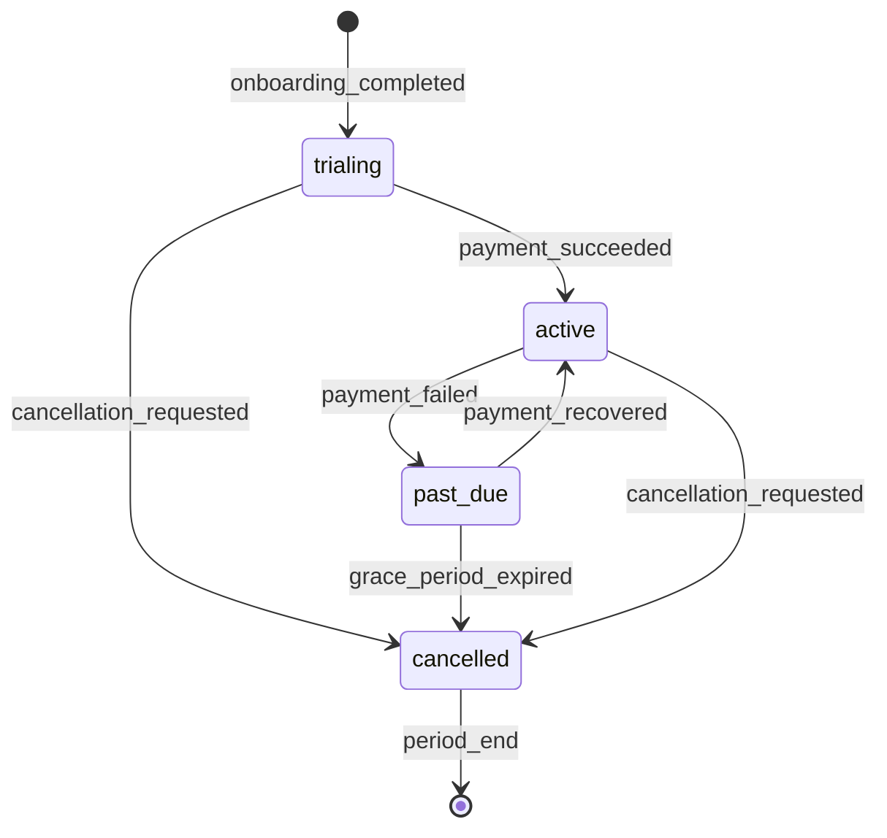

# Subscription Model

> **Fase:** 6.0.0 — SaaS Domain Consolidation
> **Status:** ✅ REVISADO PELO PO — 2026-07-28
> **Decisões:** Ver `BUSINESS_DECISIONS.md` (F3, F4, F5, F6)

---

## 1. Subscription Entity

```typescript
interface Subscription {
  id: UUID;
  tenant_id: UUID;             // FK → tenants
  plan_slug: string;           // FK → plans
  status: SubscriptionStatus;
  trial_start: timestamptz | null;
  trial_end: timestamptz | null;
  current_period_start: timestamptz;
  current_period_end: timestamptz;
  cancelled_at: timestamptz | null;
  cancel_at_period_end: boolean;
  created_at: timestamptz;
  updated_at: timestamptz;
}
```

### 1.1 SubscriptionStatus

```typescript
enum SubscriptionStatus {
  trialing    = 'trialing',
  active      = 'active',
  past_due    = 'past_due',
  cancelled   = 'cancelled',
  expired     = 'expired',
}
```

---

## 2. Ciclo de Vida da Assinatura



### 2.1 Eventos

| Evento | Gatilho | Efeito |
|--------|---------|--------|
| `SubscriptionCreated` | `provision_new_tenant` + onboarding | Inicia trial |
| `SubscriptionActivated` | Primeiro pagamento | Tenant → active |
| `SubscriptionPastDue` | Falha no pagamento | Tenant → past_due |
| `SubscriptionSuspended` | Fim da carência | Tenant → suspended |
| `SubscriptionCancelled` | Solicitação ou regra | Tenant → cancelled |
| `SubscriptionExpired` | Fim do período pós-cancelamento | Tenant → archived |

---

## 3. Billing Periods

| Intervalo | Descrição |
|-----------|-----------|
| `monthly` | Cobrança a cada 30 dias |
| `yearly` | Cobrança anual (2 meses grátis) |

### 3.1 Trial — **14 dias** (decisão do PO)

- Inicia no **provisionamento do tenant** (não no `complete_onboarding()`; ver D3/F3)
- Duração: **14 dias** (plano `pro`/`premium` definem `trial_days`)
- Durante o trial: todas as features do plano ativo
- Ao expirar: `trial → active` se pagamento confirmado, senão `trial → past_due`

---

## 4. Invoice Model

```typescript
interface Invoice {
  id: UUID;
  subscription_id: UUID;
  tenant_id: UUID;
  amount_cents: number;
  currency: string;            // "BRL"
  status: InvoiceStatus;
  due_date: timestamptz;
  paid_at: timestamptz | null;
  period_start: timestamptz;
  period_end: timestamptz;
  created_at: timestamptz;
}

enum InvoiceStatus {
  pending    = 'pending',
  paid       = 'paid',
  overdue    = 'overdue',
  cancelled  = 'cancelled',
  refunded   = 'refunded',
}
```

---

## 5. Regras de Negócio

| Regra | Comportamento |
|-------|---------------|
| 1 tenant = 1 subscription ativa | UNIQUE constraint em tenant_id WHERE status IN ('trialing','active','past_due') |
| Trial | **14 dias** (F3) |
| Grace period | **5 dias** após `past_due`; após isso → `suspended` (F4) |
| Cancelamento | `cancel_at_period_end = true`; acesso mantido até fim do período |
| Reativação | Só possível dentro do mesmo período ou até 30 dias após cancelamento |
| Retenção de dados | **NUNCA excluir dados automaticamente** (F5) |
| Dunning | 3 tentativas de cobrança com intervalos de 3 dias |
