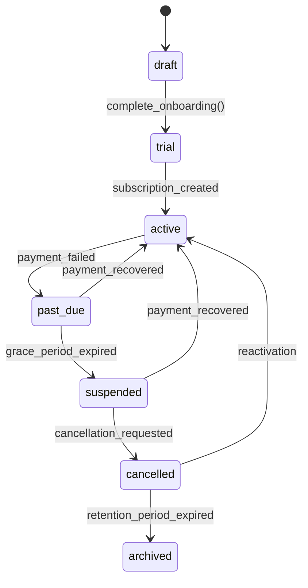

# Tenant Model

> **Fase:** 6.0.0 — SaaS Domain Consolidation
> **Status:** ✅ REVISADO PELO PO — 2026-07-28
> **Decisões:** Ver `BUSINESS_DECISIONS.md` (F14)

---

## 1. Tenant Entity

```typescript
interface Tenant {
  id: UUID;                    // PK, gerado por gen_random_uuid()
  name: string;                // Nome comercial (ex: "Sanchez Barber")
  slug: string;                // URL-friendly único (ex: "sanchez-barber")
  status: TenantStatus;        // Enum de 7 estados
  plan: string;                // Slug do plano (ex: "free", "pro", "enterprise")
  app_slug: string;            // Slug do app (ex: "barber")
  onboarding_completed: boolean;
  created_at: timestamptz;
  updated_at: timestamptz;
}
```

### 1.1 Relacionamentos

```
Tenant 1──1 TenantSettings
Tenant 1──N Profile (users)
Tenant 1──N Staff (employees)
Tenant 1──1 Subscription (current plan)
Tenant 1──N AuditLog
```

### 1.2 TenantSettings

```typescript
interface TenantSettings {
  id: UUID;
  tenant_id: UUID;             // FK → tenants, UNIQUE
  chair_count: number | null;
  business_hours: JSONB | null;
  timezone: string | null;     // Ex: "America/Sao_Paulo"
  currency: string | null;     // Ex: "BRL"
  phone: string | null;
  cnpj: string | null;
  address_street: string | null;
  address_number: string | null;
  address_city: string | null;
  address_state: string | null;
  address_zip: string | null;
  created_at: timestamptz;
  updated_at: timestamptz;
}
```

---

## 2. Tenant Status (7 estados)



Ver máquina de estados completa em `LIFECYCLE_MODEL.md`.

---

## 3. Segurança

- **RLS:** `tenant_id = current_tenant_id_from_auth_uid()`
- **Acesso:** Usuário só vê dados do seu tenant
- **Superadmin:** Bypass via `current_is_super_admin_from_auth_uid()`
- **App isolation:** `app_slug` separa dados por produto (barber, auto, club)

---

## 4. Constraints

| Coluna | Regra |
|--------|-------|
| `slug` | UNIQUE, gerado por `generate_unique_slug()` |
| `status` | NOT NULL, DEFAULT 'draft' |
| `plan` | NOT NULL, DEFAULT 'free' |
| `app_slug` | NOT NULL, DEFAULT 'barber' |

---

## 5. Dependências

| Migration | O que criou |
|-----------|-------------|
| MIG #8 (`20260724000000`) | `tenants.plan` |
| MIG #10 (`20260728000000`) | `tenants.status`, `tenants.app_slug`, `tenant_settings`, ENUM, RPCs |
